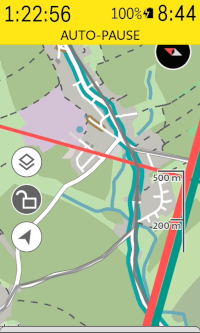

# Karoo Tilehunting Extension

This extension for Karoo devices adds a map overlay that shows explored tiles and shows an alert if you ride into an unexplored one. Optionally, past activities are also displayed on the map. Tiles and activities are fetched from [statshunters.com](https://www.statshunters.com).
You can read more about tilehunting in the [StatsHunters FAQ](https://www.statshunters.com/faq-10-what-are-explorer-tiles) or watch the [nice introduction video](https://www.youtube.com/watch?v=e63UKfvPw9g) for an overview on StatsHunters' features.

Compatible with Karoo 2 and Karoo 3 devices.

## Installation

If you are using a Karoo 3, you can use [Hammerhead's sideloading procedure](https://support.hammerhead.io/hc/en-us/articles/31576497036827-Companion-App-Sideloading) to install the app:

1. Using the browser on your phone, long-press [this download link](https://github.com/timklge/karoo-tilehunting/releases/latest/download/app-release.apk) and share it with the Hammerhead Companion app.
2. Your karoo should show an info screen about the app now. Press "Install".
3. Open the app from the main menu and link your StatsHunters account (see "Usage" below)

If you are using a Karoo 2, you can use manual sideloading:

1. Download the apk from the [releases page](https://github.com/timklge/karoo-tilehunting/releases) (or build it from source)
2. Set up your Karoo for sideloading. DC Rainmaker has a great [step-by-step guide](https://www.dcrainmaker.com/2021/02/how-to-sideload-android-apps-on-your-hammerhead-karoo-1-karoo-2.html).
3. Install the app by running `adb install app-release.apk`.
4. Open the app from the main menu and link your StatsHunters account (see "Usage" below)

## Usage

After installing this app on your Karoo, open the app from the extensions menu. Tap on the
"Connnect StatsHunters" button to connect your account. You will need to open the
[StatsHunters share page](https://www.statshunters.com/share) on your phone or computer, create
a sharing link that includes your heatmap with tiles and activities enabled and type
in the sharing code of your new link on the Karoo.

After saving your code, the app will try to download the activities and your explored tiles.
Make sure you are connected to WiFi for this step. The app will then draw the outlines of your explored and unexplored tiles
onto the map when you start a ride.

Please note that currently, only tiles close to your current location are drawn,
regardless of where you pan on the map if you unlock it. 

The following colors are used:

- Blue: Your biggest continuous explored square of tiles
- Green: A tile whose neighbors are all explored
- Red: A tile that is explored, but has unexplored neighbors
- Gray: An unexplored tile
- Bright Green / Lime: A tile you have just explored

If you ride into a new tile, the app will show an alert and draw the tile in bright green.
You can reset the bright green colored tiles by tapping the "Reset Tiles" button in the app's menu.

To view past rides, enable the respective setting in the app's main menu. The app will then show your past rides on the map as light gray lines.

You can temporarily hide the tile outlines on the map by tapping the stack icon in the same way you can hide the native heatmap.
You can add the count of explored tiles and count of recently explored tiles to your data pages as data fields.

## Credits

- Icons are from [boxicons.com](https://boxicons.com) ([MIT-licensed](icon_credits.txt))
- Interfaces with [statshunters.com](https://www.statshunters.com)
- Uses [karoo-ext](https://github.com/hammerheadnav/karoo-ext) (Apache2-licensed)
- Alert sound played over bluetooth is Alert6 by RICHERlandTV - https://freesound.org/s/351545/ (CC-BY 4.0)
